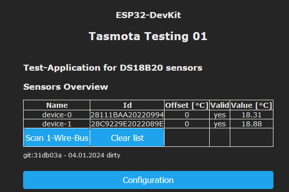
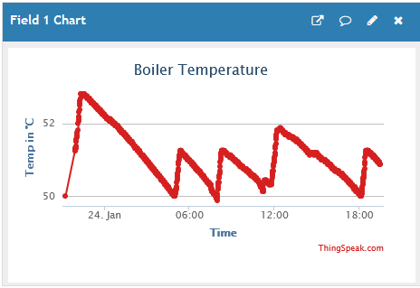
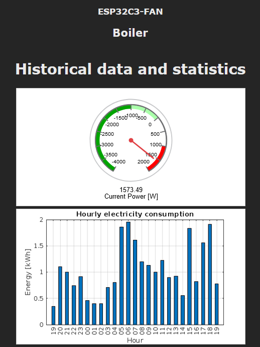
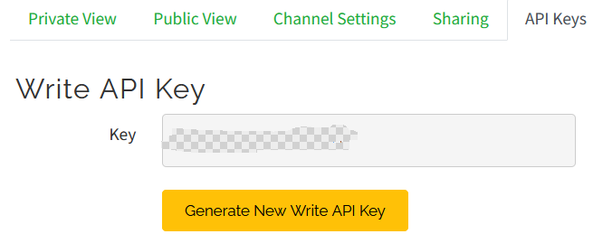

# Berry-DallasTemperature

A Berry application for DS18B20 temperature sensors

This application

- scans the 1-Wire bus looking for DS18B20-sensors
- captures the ID of each existing sensor
- acquires the temperature values from the sensors
- checks the validity of the values
- detects fault situations
- each sensor value can be adjusted via offset
- shows a nice UI with the sensor data and some controls
- transmits the temperature-values ​​via sensor-message
- support of SetOption8 (Fahrenheit/Celsius)
- support of Command TempOffset (default offset for unregistered sensors)
- detects faked sensors (not original Maxim)
- option: freeze value on error

## Motivation

I attach great importance to stable error detection. 

Unfortunately, the power-on-reset value of the sensor with the value 85 is not clear.</br>
The application tries to eliminate this disadvantage.

If a sensor is used in an application, its status must be signaled even if it is not connected.</br>
The registration method takes this requirement into account.


## Different Scenes

After start of application without connected sensors

- sensores are connected but no bus-scan has done


After bus-scan has performed




After sensor's device-0 data-pin is yanked


## How to install

Default GPIO 16 is used. You can adjust this setting in file 'DallasTemp01.be'
Do not configure the used GPIO in menu 'Configuration/Configure Module'.


- upload following files to to the tasmota-controller
    - DallasTemp.app
    - DallasTemp01.be
    - DallasTemp02.be
  
- Restart the controller

After that the "After start of application" scene should be visible.

### Registered vs. temporary sensors

A sensor is registered via its address.
    - the application is constantly trying to read values ​​from this sensor
    - it cannot be deleted from the list of sensors to be detected.

### Button 'Scan'

Initiates the Bus-Scanning process, that collects the available devices.

### Button 'Clear list'

All temporary sensors will be cleared in the task list, but never those sensors, which are registered.

```be
device = dallasTemp.register("28C9229E2022089E")
device.name = "myDevice.02"
device.offset = 1
```

### Enable Logging

The berry-variable 'dallasTemp' is global.

Use following statement in the Berry-Console to obtain more log-information.

```be
    dallasTemp.infoEnable=true
```

### Enable/disable enrichment of the sensor message tele/.../SENSOR

```be
    dallasTemp.enableSensorMsg=true
```

If 'enableSensorMsg' is activated then the sensor messages will be extended like

```json
 {
	"Time": "2024-01-16T18:42:21",
	"ANALOG": {
		"Illuminance1": 0
	},
	"OneWire.Group.01": {
		"gpio": 16,
		"devices": [
			{
				"address": "28C9229E2022089E",
				"name": "Boiler Temperature",
				"value": 33.0,
				"hasError": false
			}
		]
	},
	"TempUnit": "C"
}     
```

The sensor value is calculated depending on 'SetOption8'.

### Fault detection

- The application detects the error when the GND/power/data pin is faulty. In this case, the status “hasError” is set to “true”.
- After an error detection, 2 consecutive valid values ​​are required to reset the hasError flag.

### Freeze value on error

If the freezeOnError property is enabled (default setting), the last captured value will not be changed as long as the capture is in error.

```be
    device = dallasTemp.register("28C9229E2022089E")
    device.freezeOnError = true      # default value is true
 ```


 # Berry-ThingSpeak - how to use the cloud service from MathLab

 If you want to store, aggregate and visualize data without a smart home server at all,<br/>
 Mathlab's ThingSpeak service is very helpful. 

 The Berry driver 'ThingSpeak' makes it easy to use ThingSpeak.

 What can you get from ThingSpeak with a free account:

 - you can save a maximum of 8 different sensor-values (analog,digital) per channel with a Tasmota controller
 - you can use a maximum of 4 channels (that's 32 different values)
 - 3 Million messages can be consumed per year

Once your values are stored into a channel, you can see them instantly using the charts

](images/ThingSpeak01.png)


It is also possible to aggregate data using Mathlab Visualization. <br/>
The following example shows the energy consumption per hour on the current day.<br/>
(raw-data sent by Tasmota are diff-values from smart-meter)

 

You can also integrate the charts into Tasmota's Web-UI via 'iframe'.

 


----------------------------------------------------

 ## 1. Step: free registration at ThingSpeak 

 [ThingSpeak Registration](https://thingspeak.com/login?skipSSOCheck=true)

 ## 2. Step: create a channel, define fields and get the 'Write API key'


 

 ## 3. Step: the first easy use


```be
# initialize the component
thingSpeak = ThingSpeak()
thingSpeak.infoEnable=true

# fast update of data each 15 seconds (240 writes per hour)
thingSpeak.updatesPerHour(240)

# define your channel write-api-key, define the 8 fields of the channel before
thingSpeak.apiKey="xxx"

# now everything is ready, set the a field value
thingSpeak.field1 = 51

# within the next 15 seconds the component writes the value to the thingspeak service exactly once

# log-output: .. ThingSpeak.write - https://api.thingspeak.com/update.json?api_key=xxxxx&field1=51 ret-code:200

# after that check the corresponding chart in ThingSpeak's Web-UI

# a further write to thingspeak needs a further write to any of the 8 fields of the channel
thingSpeak.field1 = 52
thingSpeak.field2 = 22

```

-----------------------------------

## A more sophisticated example wired with component DallasTemp

Uncomment the block at the of the file 'DallasTemp02.be' and define the API-key.

```be
thingSpeak.apiKey="your-api-key"
``` 

Restart the Controller and after a while you will see following log-output

```be
INFO ThingSpeak.write - https://api.thingspeak.com/update.json?api_key=xxxxxxx&field1=20.6875 ret-code:200
```

From now on, the temperature will be saved in the cloud at intervals.
Verify this by checking the chart for 'field1'.

**Have fun with ThingSpeak and Berry.**


