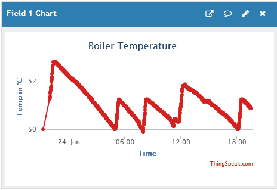
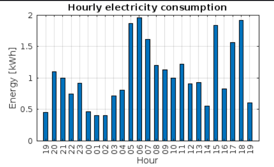
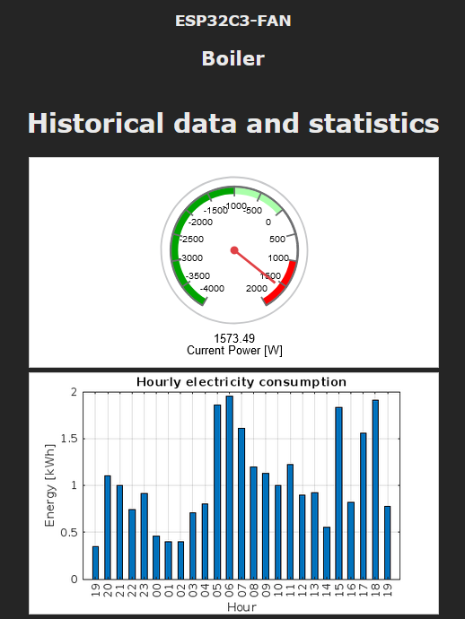
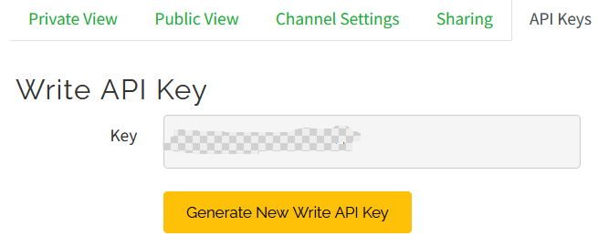

 # Berry-ThingSpeak - how to use the cloud service from MathLab

 What can you get from ThingSpeak with a free account:

 - you can save a maximum of 8 different sensor-values (analog,digital) per channel with a Tasmota controller
 - you can use a maximum of 4 channels (that's 32 different values)
 - 3 Million messages can be consumed per year

Once your values are stored into a channel, you can see them instantly using the charts

](images/ThingSpeak01.png)


It is also possible to aggregate data using Mathlab Visualization. <br/>
The following example shows the energy consumption per hour on the current day.<br/>
(raw-data sent by Tasmota are diff-values from smart-meter)

 

You can also integrate the charts into Tasmota's Web-UI via 'iframe'.

 


----------------------------------------------------

 ## 1. Step: free registration at ThingSpeak 

 [ThingSpeak Registration](https://thingspeak.com/login?skipSSOCheck=true)

 ## 2. Step: create a channel, define fields and get the 'Write API key'


 

 ## 3. Step: the first easy use


```be
# initialize the component
thingSpeak = ThingSpeak()
thingSpeak.infoEnable=true

# fast update of data each 15 seconds (240 writes per hour)
thingSpeak.updatesPerHour(240)

# define your channel write-api-key, define the 8 fields of the channel before
thingSpeak.apiKey="xxx"

# now everything is ready, set the a field value
thingSpeak.field1 = 51

# within the next 15 seconds the component writes the value to the thingspeak service exactly once

# log-output: .. ThingSpeak.write - https://api.thingspeak.com/update.json?api_key=xxxxx&field1=51 ret-code:200

# after that check the corresponding chart in ThingSpeak's Web-UI

# a further write to thingspeak needs a further write to any of the 8 fields of the channel
thingSpeak.field1 = 52
thingSpeak.field2 = 22

```

-----------------------------------

## A more sophisticated example wired with component DallasTemp

Uncomment the block at the of the file 'DallasTemp02.be' and define the API-key.

```be
thingSpeak.apiKey="your-api-key"
``` 

Restart the Controller and after a while you will see following log-output

```be
INFO ThingSpeak.write - https://api.thingspeak.com/update.json?api_key=xxxxxxx&field1=20.6875 ret-code:200
```

From now on, the temperature will be saved in the cloud at intervals.
Verify this by checking the chart for 'field1'.

**Have fun with ThingSpeak and Berry.**


